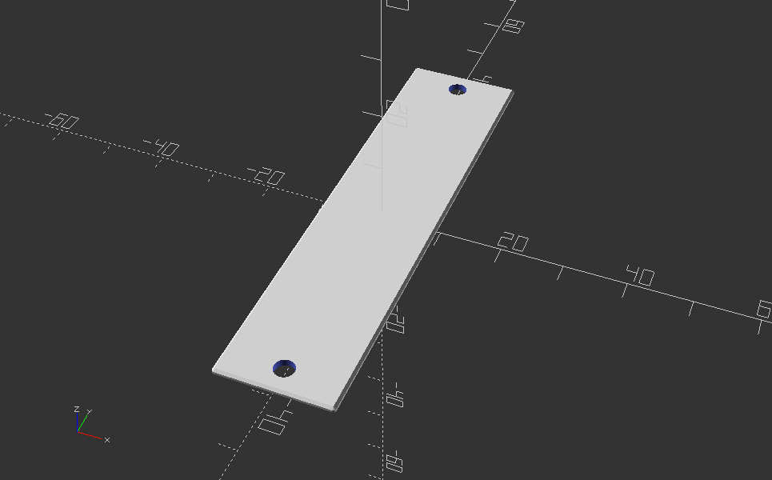
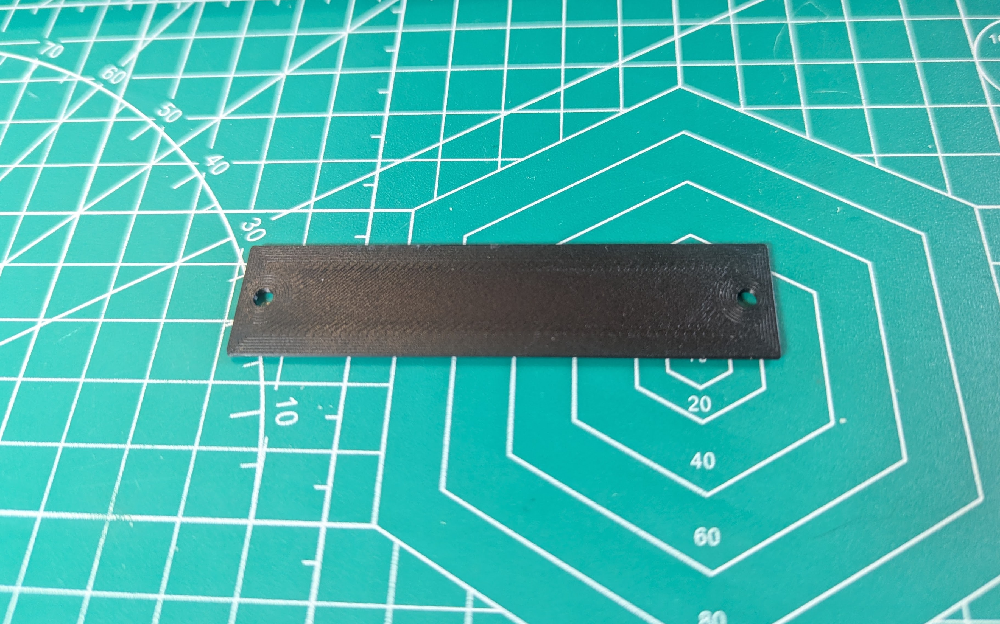
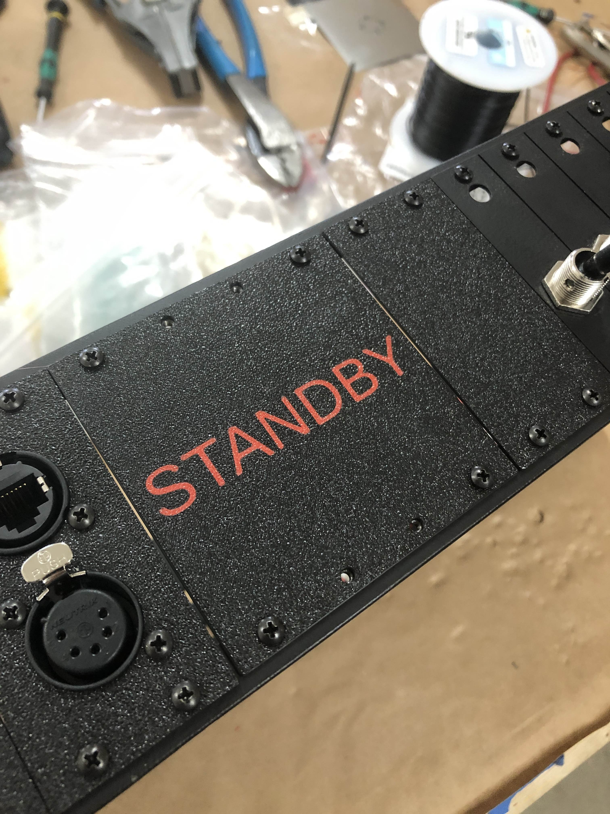

# Prospero Plate Creator

Makes custom-sized front panel plates for the [Prospero Cue Light Panel by Ben Peoples Industries](https://benpeoples.com/stock-products/prospero-cue-light-system/).

[Posted on MakerWorld.](https://makerworld.com/en/models/1487187-prospero-plate-creator)

Runs in OpenSCAD but if you want to do multicolor stuff with text that feature is only available on MakerWorld at the moment.

Colors are just set for visibility and object separation, the actual filaments can be chosen in the slicer afterwards.

If you're running in OpenSCAD and you'd like to use other fonts you can use the options at the end of the customizer, or edit the variables yourself with fonts found on your system.  When running on MakerWorld it uses their built-in font chooser.

Suggested printing tips: Print with a stronger profile than usual for more stiffness in very thin plates.  (For example: Wall loops - 6, infill - 25%.)

Version 1.1 - 2025-06-04
Remove end plate feature (not needed in this configuration)

Version 1.0 - 2025-06-04
Initial release
