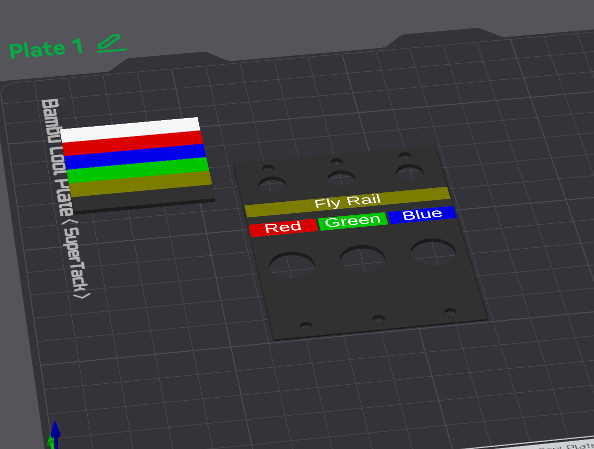

# Prospero Plate Creator

Makes custom-sized front panel plates for the [Prospero Cue Light Panel by Ben Peoples Industries.](https://benpeoples.com/stock-products/prospero-cue-light-system/)

[Posted on MakerWorld.](https://makerworld.com/en/models/1487187-prospero-plate-creator)

This was created with the blessing of BPI and using it won't void your warranty or anything but please don't contact them for support.  If you have any issues or suggested improvements for this customizer, please use the issues section on [GitHub.](https://github.com/kevinrmccoy/Prospero-Plate-Creator)

This customizer can run locally in OpenSCAD but if you want to do multicolor stuff with text or images that feature is only available on MakerWorld at the moment (or requires some knowledge of how to export separate objects from OpenSCAD.)

Colors are just set for visibility and object separation -- MakerWorld exports separately-colored objects as different filaments in the resulting 3MF, and the actual filaments can be chosen in the slicer before printing.

## Features

NOTE: Most features have an "enable" toggle at the beginning of their section.  Make sure you enable it for that feature to be rendered.

Most features include options to emboss or deboss, which work as expected.  If you also select the relevant "separate' option, an embossed feature will use a different color (making it a separate filament in the 3mf file) and in deboss mode it will make a separately-colored feature flush with the surface.

### Electronics Holes

Cuts holes for the switch and LED on a standard Prospero single-switch plate.  The default size settings make the LED hole large enough to slip over the LED lens and the switch hole the right size to be captured by the switch nut.  See the suggested use cases section below for more information.

### Full Plate Text

Places a single line of text on the plate according to the settings given.  The offset for this text is measured from the center of the whole plate (with the default being centered on both axes.)

Using a backslash (\\) in the text will add a line break.

Choose the "enable text full backing" option to have a different color behind the text, giving the appearance of a text label on colored tape.

### Per Switch Text

Allows separate labels for each switch plate.  Enter the text with each switch separated by commas, for example "SL, US, SR" for three switches.  Spaces will be removed from the beginning and end of each item.  A blank switch can be created by using an extra comma.  Including a backslash (\\) in the text will add a line break for that switch's text. The text settings are the same for all switches, but they're separate from the "full plate" text settings.  Offsets are based from the centerline of each switch.  When the "text separate" option is enabled, the text for each switch will be a slightly different color, which makes them appear as separate filaments in the 3mf file.  If you want them all the same, you can merge them in your slicer.

Choose the "enable text ps backing" option to have a different color behind the text, giving the appearance of a text label on colored tape.  This color will be different for each switch allowing you to make color and filament choices in your slicer.

### SVG Information

Allows you to place an SVG file on the plate.  The file interpreter treats all colors as the same and doesn't recognize things like masks.  If your file appears as a solid square or rectangle there's probably an invisible border being drawn in the file, check the SVG in a text editor to remove extra bits.  I've included a default.svg as an example in the github repo.

[Check this OpenSCAD page for information on SVG files.](https://en.wikibooks.org/wiki/OpenSCAD_User_Manual/SVG_Import)

### PNG Information

Allows you to place a PNG file on the plate.  At the default scaling parameter of 0.1, this appears as 1 mm per 10 pixels.  The PNG file is interpreted as a height map with white being a full emboss or deboss (scaled to the PNG effect depth parameter), black being no height change, and greys or colors interpreted in between.  I've included a default.png as an example in the github repo.

[Check this OpenSCAD page for information on PNG files and the calculation for the height based on colors.](https://en.wikibooks.org/wiki/OpenSCAD_User_Manual/Importing_Geometry#surface)

### Stiffener Backing Information

Adds a set of features to the back of the plate that can strengthen the plate if used to mount a switch and LED directly.  See the related use case below for important caveats.  When the plate will be mounted on the first switch position (furthest left) or last position (furthest right), make sure to set the "end_plate" parameter as appropriate to cut out enough clearance for the side of the frame.

## Use Cases

### Decorative Blank

Use a blank panel to decorate an empty section of your Prospero with your show's logo.  The default plate thickness of 1.2 mm works well for this, and the printed plate completely replaces the existing Prospero blanks.  Text or logos at 0.4 mm depth are effective, and if you use the deboss feature you may find it beneficial to print the plate face down to help with text or image clarity.  Also a smaller nozzle will make for clearer decorations.

### Label Overlay

For a clean, printed label on existing switches, try turning on the "electronics holes" option, set the plate thickness to 0.6 mm, and set up labels in the text fields, such as "Automation" in the full plate text field with a height offset of 15 mm, and "Red, Blue, Green" for the per switch text field with a height offset of 6 mm.  Smaller nozzles can help with text clarity.  Mount these plates over existing plates by unscrewing the switch nuts, sliding the printed plate over the switch and LED lens, holding it in place with the switch nut, then secure to the Prospero unit with the regular screws.

### Switch Mounting

THIS IS EXPERIMENTAL.  3D printed switch plates cannot be as strong as metal plates so use this with caution.  If you intend to mount a switch to the plate, it's recommended to use extra wall loops and a much higher infill percentage.  Printing wider plates for multiple switches improves stability as a single plate is able to twist horizontally with sideways pressure on the switch.  This is a use case that should probably be reserved for emergencies or unusual circumstances.

## Other Information

Combining the text, SVG, and PNG features might result in strange results, especially if they overlap.  Check the 3MF in your slicer to make sure you've got what you wanted.

Suggested printing tips: Print with a stronger profile than usual for more stiffness in very thin plates.  (For example: Wall loops - 6, infill - 25%.)

The screws to hold the plates to the unit are 1/4" #4-40, as indicated in the [Prospero Parts Visual Reference provided by Ben Peoples Industries.](https://docs.benpeoples.com/prospero-dmx-cue-light-panel/prospero-parts-visual-reference#3d6a672da66f4d4db09283e1e5e6c471)

## Version History

Version 1.7 - 2025-08-17

- Add multiline text

Version 1.61 - 2025-08-08

- Adjust text backing defaults and ranges.

Version 1.6 - 2025-07-01

- Add option for text background rectangles for color-backed labels.

Version 1.5 - 2025-06-26

- Add option for stiffener backing ribs to allow for mounting switches in limited circumstances

Version 1.4 - 2025-06-24

- Add option for switch and LED holes
- Add option for separate text per switch

Version 1.3 - 2025-06-12

- Add option for corner holes only

Version 1.21 - 2025-06-10

- Improve PNG deboss feature

Version 1.2 - 2025-06-09

- Add SVG and PNG features

Version 1.1 - 2025-06-04

- Remove end plate feature (not needed in this configuration)

Version 1.0 - 2025-06-04

- Initial release
